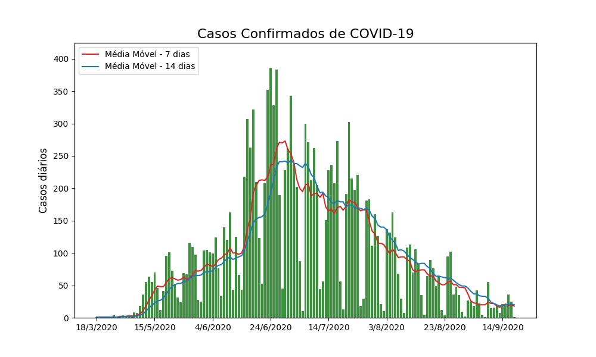

# Moving average in cases of covid-19

Moving average graph with covid-19 data in state of Rio Grande do Norte - Brazil.

## Requirements

- python3-tk: `sudo apt-get install python3-tk`
- [pipenv](https://pypi.org/project/pipenv/)

## Usage

Type the following commands:

```bash
pipenv shell
pipenv install
python main.py [OPTIONS]
```

## Options

Option | Type | Default | Description
------ | ---- | ------- | -------
-ma | list | 7 14 | Moving averages in days
-l | bool | false | Use local data instead of fetch data online

## Results

### Fetching Data


### Local Data


